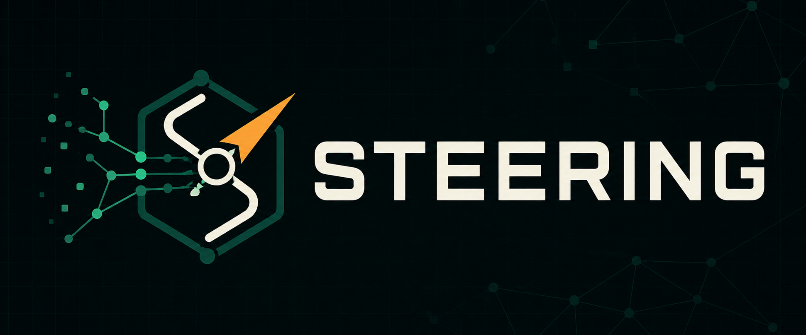

<p align="center">
  
</p>

<h1 align="center">STEERING</h1>

<p align="center"><strong>Turn scattered Frontier AI discoveries into engineering direction.</strong></p>

<p align="center">
  <sub><strong>System for Translating Evolving Engineering Research into Intelligence using Graphs</strong></sub>
</p>

<p align="center">
  <a href="https://github.com/Otto-Destiny/steering/actions/workflows/ci.yml"></a>
  
  
  <a href="LICENSE"></a>
  
</p>

<p align="center">
  <a href="#quickstart"><strong>Quickstart</strong></a>
  &nbsp;&middot;&nbsp;
  <a href="#what-01-includes"><strong>Features</strong></a>
  &nbsp;&middot;&nbsp;
  <a href="docs/architecture.md"><strong>Architecture</strong></a>
  &nbsp;&middot;&nbsp;
  <a href="#connect-an-ai-coding-agent"><strong>MCP</strong></a>
  &nbsp;&middot;&nbsp;
  <a href="CONTRIBUTING.md"><strong>Contributing</strong></a>
</p>

---

AI engineering moves too fast to rely on memory alone. Every day, you come across new ideas, papers,
shared tricks, and upgrades on X, LinkedIn, GitHub, and arXiv. STEERING continuously transforms
evolving research into structured engineering intelligence connected through a knowledge graph.
Every new discovery becomes connected, searchable, and architecture-ready, so your coding agents
always design with current knowledge. Query it from Claude Code, Codex, or any MCP-compatible agent.
Build with today's best ideas, not yesterday's. STEERING is the missing intelligence layer for AI agents engineering today.

> [!NOTE]
> **STEERING is currently at `0.1.0` alpha.** The complete local workflow is implemented; resolver and
> internal extension contracts may change before the stable release.

## What 0.1 includes

- Public X oEmbed capture, public LinkedIn capture, and explicit isolated browser capture for content
  you are authorized to view.
- GitHub README, platform-neutral paper/PDF, scholarly HTML, documentation, webpage, pasted text,
  batch file, Telegram HTML/JSON export, and disposable file-upload ingestion.
- LLM-based structured extraction with exact source-span validation, provenance snapshots, trust
  lanes, contradiction issues, and immutable source history.
- Hybrid exact, BM25, embedding, graph, and project-history retrieval with strategy-family diversity.
- Architecture reviews and idea cards containing constraints, limitations, citations, uncertainty,
  and minimal experiments.
- A responsive local web UI, typed JSON API, CLI, and seven Streamable HTTP MCP tools for Codex,
  Claude, and compatible clients.
- One embedded Ladybug database, verified logical backups, OS-keyring secrets, and no account or cloud
  service.

## Quickstart

Requirements: Python 3.11 and [uv](https://docs.astral.sh/uv/). Chromium is needed only for the
optional signed-in browser capture.

```powershell
git clone https://github.com/Otto-Destiny/steering.git
cd steering
uv sync --all-extras --dev
uv run playwright install chromium
```

Configure generation and embedding independently. Keys are read through a hidden prompt and stored in
the operating-system credential store, never the JSON configuration or database.

```powershell
uv run steering configure-provider --role generation --provider-id openai-compatible `
  --base-url https://api.example.com/v1 --model your-generation-model

uv run steering configure-provider --role embedding --provider-id openai-compatible `
  --base-url https://api.example.com/v1 --model your-embedding-model --dimension 1536
```

Leave the hidden key prompt blank for an OpenAI-compatible local endpoint that does not require
authentication. Environment overrides are also supported; see [privacy and security](docs/privacy-security.md).

Start the one localhost daemon:

```powershell
uv run steering serve
```

Open `http://127.0.0.1:8765`, or add content directly:

```powershell
uv run steering add https://github.com/example/project
uv run steering add --batch saved-links.txt
uv run steering import-telegram path/to/result.json
uv run steering doctor
```

Knowledge construction requires a configured generation model. Until an embedding provider is set,
STEERING uses a deterministic local lexical embedding fallback so the application and exact/BM25
retrieval remain usable.

## Connect an AI coding agent

Run `uv run steering agent-config codex` or `uv run steering agent-config claude` for reviewable setup
instructions. The MCP endpoint is `http://127.0.0.1:8765/mcp` and exposes:

- `search_knowledge`
- `get_knowledge_record`
- `explore_design_options`
- `compare_entities`
- `review_architecture`
- `record_project_decision`
- `record_experiment_outcome`

The `design_with_steering` MCP prompt guides an agent to use retained evidence at architecture start,
before major technology choices, during training/evaluation design, and when ordinary options fail.

## Trust and privacy boundaries

- Unreviewed social claims remain in the **Experimental** lane.
- Contradictions retain both exact statements and appear in **Issues** until resolved.
- Browser capture uses a visible STEERING-managed profile and never reads your normal browser profile.
- Upload and fetched media binaries are processed in memory and discarded; the graph retains extracted
  text, hashes, provenance, and source links.
- Network fetching blocks credentials in URLs and private, loopback, link-local, or reserved targets.
- The daemon binds only to loopback, and browser mutations enforce localhost and same-origin checks.

Read [architecture](docs/architecture.md), [data model](docs/data-model.md),
[resolver boundaries](docs/resolvers.md), and [privacy and security](docs/privacy-security.md) for detail.

## Evaluation and development

The committed 51-artifact discovery corpus and 26 realistic architecture prompts provide deterministic
offline regression coverage. The current hybrid retriever recalls 80 of 91 seeded relevant ideas in
the top 10 (`87.91%`) and returns at least four strategy families in every applicable breadth case.
Every evaluated retrieval result retains a source URL (`100%` retrieval-result citation coverage);
across 20 architecture scenarios, all 465 surfaced factual claims retain their exact quote, snapshot,
and evidence-span pointer (`100%` claim-evidence coverage).

```powershell
uv run python evaluate/run_offline_evaluation.py `
  --factory steering.runtime:evaluation_factory `
  --output .work/offline_evaluation.json

uv run python scripts/check.py

$env:STEERING_SCALE_TEST = "1"
uv run pytest tests/retrieval/test_target_scale.py -m performance -q
```

The canonical check verifies the lockfile, Ruff, strict Mypy, tests with at least 85% coverage, package
build, and an isolated wheel install with CLI and daemon-factory smoke tests. See
[CONTRIBUTING.md](CONTRIBUTING.md) for the small,
cross-platform contributor workflow.

## Known 0.1 limits

- Continuous crawling, automatic bookmark synchronization, accounts, cloud sync, and team
  collaboration are intentionally out of scope.
- Signed-in capture is a user-triggered fallback, not bulk timeline automation.
- Paywalls and access controls are never bypassed; upload a paper you are authorized to use instead.
- The opt-in 10,000-artifact/100,000-chunk warm-search benchmark passes locally. Its manual GitHub
  workflow must still be verified on Windows, Ubuntu, and macOS before a release is tagged.
- Provider compatibility depends on support for the OpenAI-compatible chat-completions and embeddings
  shapes used by STEERING. Multimodal image extraction additionally requires vision input support.

## License and community

Apache-2.0. Please read [CONTRIBUTING.md](CONTRIBUTING.md), [CODE_OF_CONDUCT.md](CODE_OF_CONDUCT.md),
[SECURITY.md](SECURITY.md), and [SUPPORT.md](SUPPORT.md) before contributing or reporting a problem.
